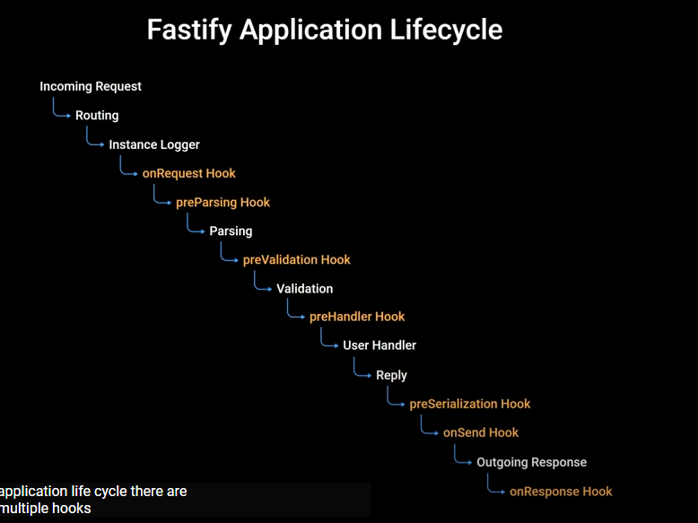
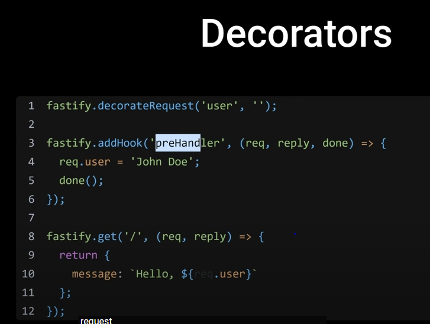

hooks are code that executes in at a certain life cycle event

hook is frequently used for authentication with json web token or attaching a user object after authentication

typically, after authentication, you want to usually attach an object of user information in the request so that it can passed to the next hand 
can use decorators to do this

decorator = 

decorators used to attach properties to native fastifier request object. 
necessary because if you dont use, request object will be deserialized. what this means simply is you'll get worst performance because fastify would not know structure of request object anymore

you have to decorate objects in order to add custom properties to them with your data